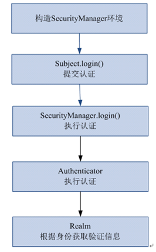

# Shiro 源码学习笔记
## 概念
+ 主题 (subject)
> 当前操作用户，但是在shiro中，不仅仅指人，也可以是第三方进程、后台账户，或其他类似事物。它仅仅意味着当前和软件交互的东西。但大部分情况下指用户。
+ 安全管理器（SecurityManager）
> 它是shiro框架的核心，典型的facade模式，shiro通过SecurityManager来管理内部组件实例，并通过它来提供安全管理的各种服务。
+ 领域 (Realm)
> 域，领域，相当于数据源，通过realm存取认证，授权相关数据。在realm中存储授权和认证的逻辑。
> 它充当了shiro与应用安全数据间的桥梁或连接器。也就是说，当对用户执行认证（登陆）和授权（访问控制）验证时，shiro会从应用配置的realm中查找用户及其权限信息。
> realm实质上是一个安全安全的dao,它封装了数据源的连接细节，并在需要时将相关数据提供给shiro,当配置shiro时，必须至少指定一个realm，用户认证和授权。
+ 认证器 （authenticator）
>  认证器，主题进行认证最终通过Authticator进行的。
+ 授权器 （authorizer）
> 授权器，主题进行授权最终通过authorizer。
+ session管理器（sessionManager）
> web应用中一般是用web容器对session进行管理，shiro也提供一套session管理的方式。
+ session操作接口（sessionDao）
> 通过sessiondao管理session数据。针对个性化的session数据存储需要用到sessionDao
+ 缓存管理器 （cache manager）
> 缓存管理器，主要对session和授权数据进行缓存，比如将授权数据通过cacheManager进行缓存管理，和ehcache整合对缓存数据进行管理。
+ 密码管理（cryptography）
>  密码管理，提供了一套加密、解密的组件，方便开发。比如提供常用的散列，加密，解密等功能。
+ 授权概念
> authz
+ 认证概念
> authc
## 案例

    // 用户登陆和退出
    @Test
    public void testLoginAndLogout() {

		// 创建securityManager工厂，通过ini配置文件创建securityManager工厂
		Factory<SecurityManager> factory = new IniSecurityManagerFactory(
				"classpath:shiro-first.ini");
		
		//创建SecurityManager
		SecurityManager securityManager = factory.getInstance();
		
		//将securityManager设置当前的运行环境中
		SecurityUtils.setSecurityManager(securityManager);
		
		//从SecurityUtils里边创建一个subject
		Subject subject = SecurityUtils.getSubject();
		
		//在认证提交前准备token（令牌）
		UsernamePasswordToken token = new UsernamePasswordToken("zhangsan", "111111");
 
		try {
			//执行认证提交
			subject.login(token);
		} catch (AuthenticationException e) {
			// TODO Auto-generated catch block
			e.printStackTrace();
		}
		
		//是否认证通过
		boolean isAuthenticated =  subject.isAuthenticated();
		
		System.out.println("是否认证通过：" + isAuthenticated);
		
		//退出操作
		subject.logout();
		
		//是否认证通过
		isAuthenticated =  subject.isAuthenticated();
		
		System.out.println("是否认证通过：" + isAuthenticated);

	}

### Shiro 认证思想
#### 认证授权的设计思想：
>  本质是对方法（路径）的控制，具体如何控制依赖于不同的设施（Spring，Web），不同环境采用的方式不同，也可以两者结合；认证过的信息如何绑定，依赖于容器对访问信息的管理，而不依赖于 Shiro 本身。
> 

### shiro  流程分析：

#### 1、账户认证
> Subject.login( token) ， 本质是交给 SecurityManager.login( subject,token);   
> login最终是交给匹配的Realm来进行认证，思想是这个人是这个领域认证的人，别的领域不认识，是一个很美妙的概念；此外，在多个领域都认识的情况下，可以根据策略去实现认证手段，
> eg，一个领域认证说明所有领域都认证，或者要求所有领域都认证，或者最后一个等等；最终认证成功后就要根据认证信息生成 Subject对象，先设置 Subject上下文，根据上下文的信息；
> 生成 Subject对象，是否保存起来；和执行一些认证成功后的执行，如处理记住我的功能；
> 
#### 2、认证流程
> 
> 

 
